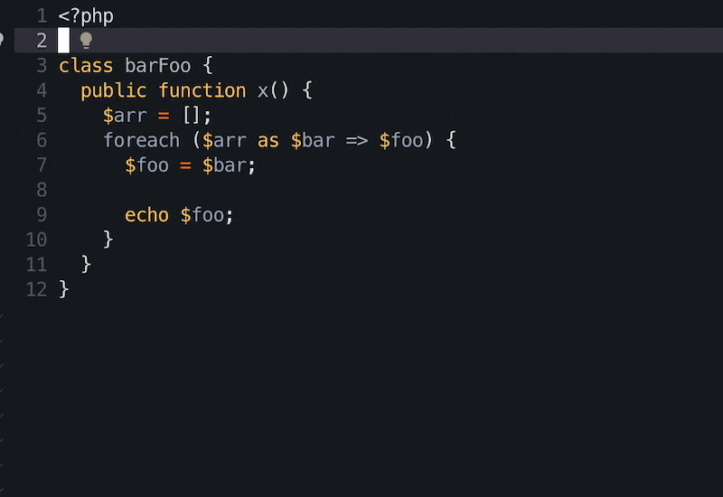

# Nvim context vt

Shows virtual text of the current context at the end of:

- functions
- methods
- if statements
- foreach statements
- classes

## Debug

If a context expected is not shown you can try to use

`lua require 'nvim_context_vt'.showDebug()` to get current and parent node info.

## Mandatory jif

## How to install

Install treesitter, then use your favourite package manager.

There are no dependencies.

